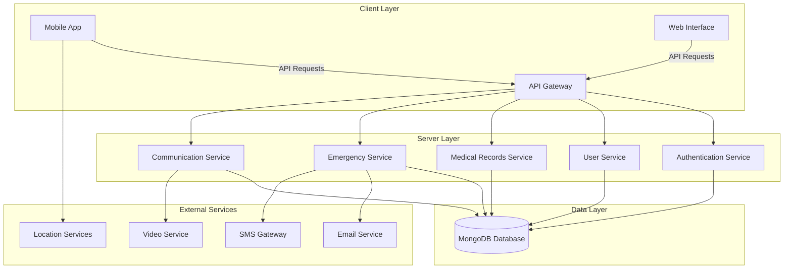
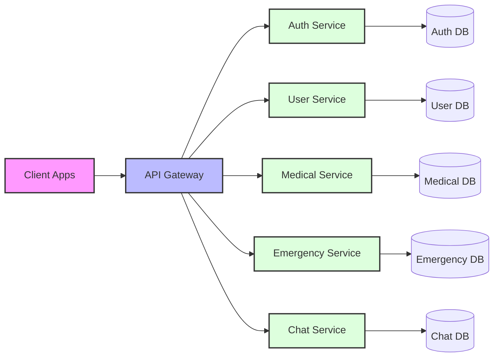
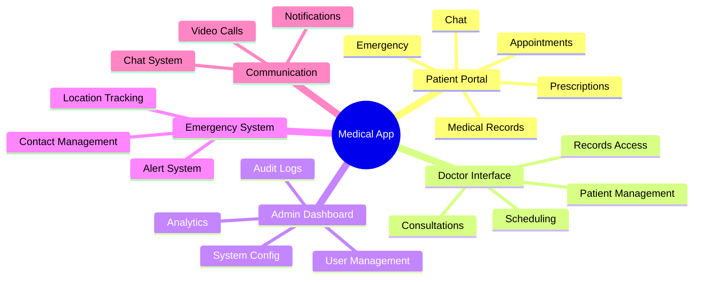

# Medical Application System

## 🏥 Project Overview

A comprehensive medical application system built with a modern tech stack, featuring both mobile and web interfaces. This system is designed to revolutionize healthcare management by providing an integrated platform for patients, healthcare providers, and administrators.

## 📋 Table of Contents

- [Features](#features)
- [System Architecture](#system-architecture)
- [Technology Stack](#technology-stack)
- [Installation](#installation)
- [API Documentation](#api-documentation)
- [Security Features](#security-features)
- [Future Enhancements](#future-enhancements)

## 🌟 Features

### 1. User Authentication & Authorization
- Secure JWT-based authentication system
- Role-based access control (Patients, Doctors, Administrators)
- Biometric authentication support
- Password encryption using bcrypt

### 2. Patient Management
- Personal health records
- Appointment scheduling
- Medical history tracking
- Document upload and management
- Real-time chat with healthcare providers

### 3. Healthcare Provider Features
- Patient appointment management
- Medical record access and updates
- Prescription management
- Emergency response system
- Audio/Video consultation capabilities

### 4. Administrative Features
- User management
- Analytics dashboard
- System monitoring
- Resource allocation
- Audit logging

### 5. Emergency Response System
- Automated email notifications
- Real-time location tracking
- Emergency contact management
- Quick response protocols

### 6. Communication Features
- Real-time chat using Socket.IO
- Video consultations
- Email notifications
- SMS alerts
- Multi-language support (i18n integration)

## 🏗 System Architecture



### Microservices Architecture



## 🛠 Technology Stack

### Frontend (Client)
- React Native (Mobile App)
- Expo Framework
- NativeWind for styling
- React Navigation for routing
- Various Expo modules for native functionality
- i18next for internationalization

### Backend (Server)
- Flask (Python)
- MongoDB for database
- JWT for authentication
- Socket.IO for real-time communication
- LangChain for AI integration
- Email and SMS integration

### Development Tools
- TypeScript for type safety
- ESLint & Prettier for code quality
- Yarn for package management
- Git for version control

## 📥 Installation

### Prerequisites
- Node.js (v16 or higher)
- Python 3.8+
- MongoDB
- Yarn package manager

### Client Setup
```bash
cd client
yarn install
yarn start
```

### Server Setup
```bash
cd server
python -m venv myenv
source myenv/bin/activate  # On Windows: myenv\Scripts\activate
pip install -r requirements.txt
python run.py
```

## 🔒 Security Features

1. Data Encryption
   - End-to-end encryption for sensitive data
   - SSL/TLS for all communications
   - Encrypted storage for medical records

2. Authentication
   - JWT-based authentication
   - Biometric authentication support
   - Multi-factor authentication

3. Authorization
   - Role-based access control
   - Granular permissions system
   - Session management

4. Compliance
   - HIPAA compliance measures
   - GDPR compliance features
   - Regular security audits

## 📱 Mobile App Features



## 🔄 API Documentation

### Authentication Endpoints
- POST /api/auth/login
- POST /api/auth/register
- POST /api/auth/refresh
- POST /api/auth/logout

### User Management
- GET /api/users
- POST /api/users
- PUT /api/users/{id}
- DELETE /api/users/{id}

### Medical Records
- GET /api/records
- POST /api/records
- PUT /api/records/{id}
- DELETE /api/records/{id}

### Appointments
- GET /api/appointments
- POST /api/appointments
- PUT /api/appointments/{id}
- DELETE /api/appointments/{id}

## 🚀 Future Enhancements

1. AI Integration
   - Symptom analysis
   - Treatment recommendations
   - Predictive analytics

2. IoT Device Integration
   - Wearable device support
   - Remote monitoring
   - Health metrics tracking

3. Enhanced Analytics
   - Machine learning models
   - Predictive health patterns
   - Population health insights

## 👥 Contributing

Please read CONTRIBUTING.md for details on our code of conduct and the process for submitting pull requests.

## 📄 License

This project is licensed under the MIT License - see the LICENSE.md file for details.

## 🙏 Acknowledgments

- Medical professionals who provided domain expertise
- Open source community for various tools and libraries
- Testing team for thorough QA
- UI/UX designers for the intuitive interface 